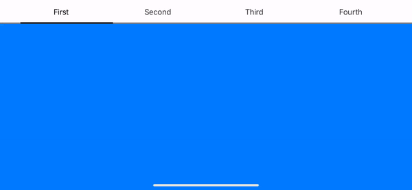

# MenuBar

SwiftUI custom top menu bar for navigation.




### Usage
Import MenuBar to your project: `import MenuBar`

You can show up to 4 items.

MenuBar example with 4 items:
```swift
 GeometryReader { geometry in
     MenuBar(firstTitle: "First", secondTitle: "Second", thirdTitle: "Third", fourthTitle: "Fourth", width: geometry.size.width, textColor: .primary, lineColor: .primary, firstView: AnyView(self.firstView), secondView: AnyView(self.secondView), thirdView: AnyView(self.thirdView), fourthView: AnyView(self.fourthView))
 }
```
MenuBar example with 2 items:
```swift
 GeometryReader { geometry in
     MenuBar(firstTitle: "First", secondTitle: "Second", thirdTitle: nil, fourthTitle: nil, width: geometry.size.width, textColor: .primary, lineColor: .primary, firstView: AnyView(self.firstView), secondView: AnyView(self.secondView), thirdView: nil, fourthView: nil)
 }
```

### Installing
Requirements: iOS 13 or later, Xcode 11 or later.

Simplest way to install is to use Swift Package Manager.
In Xcode got to `File -> Swift Packages -> Add Package Dependency` and paste inthe repo's url: `https://github.com/ViktorMaric/MenuBar`
